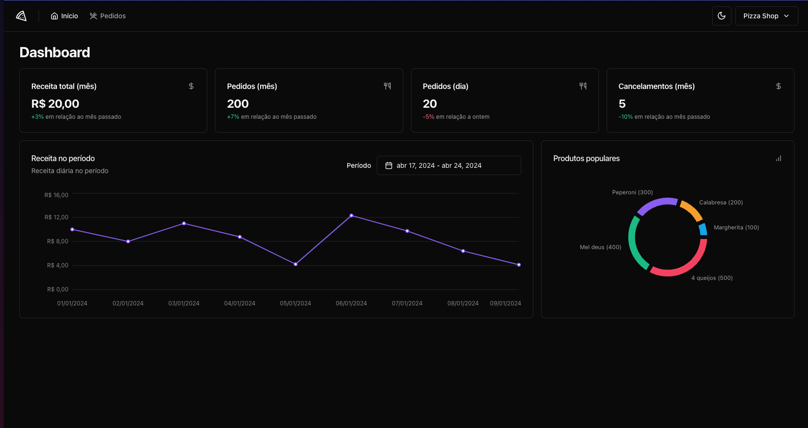

## Pizza shop 

A simple application to study new technologies. 

The idea is to be a small order listing system for a restaurant.
It has a dashboard that shows daily and monthly metrics with graphs and percentages.
You can also list orders and details.
And change the name and description of the restaurant.

This project has both unit (vitest) and e2e (playwright) tests

### Technologies used

- [TypeScript](https://www.typescriptlang.org/)
- [React](https://pt-br.legacy.reactjs.org/)
- [Vite](https://vitejs.dev/)
- [Vitest](https://vitest.dev/)
- [MSW](https://mswjs.io/)
- [shadcn/ui](https://ui.shadcn.com/)
- [zod](https://zod.dev/)
- [sonner](https://sonner.emilkowal.ski/)
- [lucide-react](https://lucide.dev/guide/packages/lucide-react)
- [recharts](https://recharts.org/en-US/)
- [playwright](https://playwright.dev/)

### How to run 

First, install dependencies
```bash
pnpm i
```

Create the `.env.local` and `.env.test` in root

```
# .env.local
VITE_API_URL="http://localhost:3333"
VITE_ENABLE_API_DELAY=true
```

```
# .env.test
VITE_API_URL="/"
VITE_ENABLE_API_DELAY=false
```

Now just start
```bash
pnpm dev
```

If u prefer run with mock API's
```bash
pnpm dev:test
```

#### Screens



